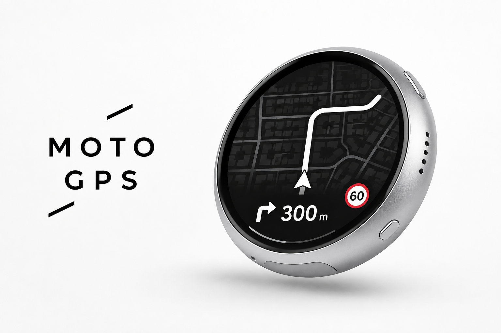
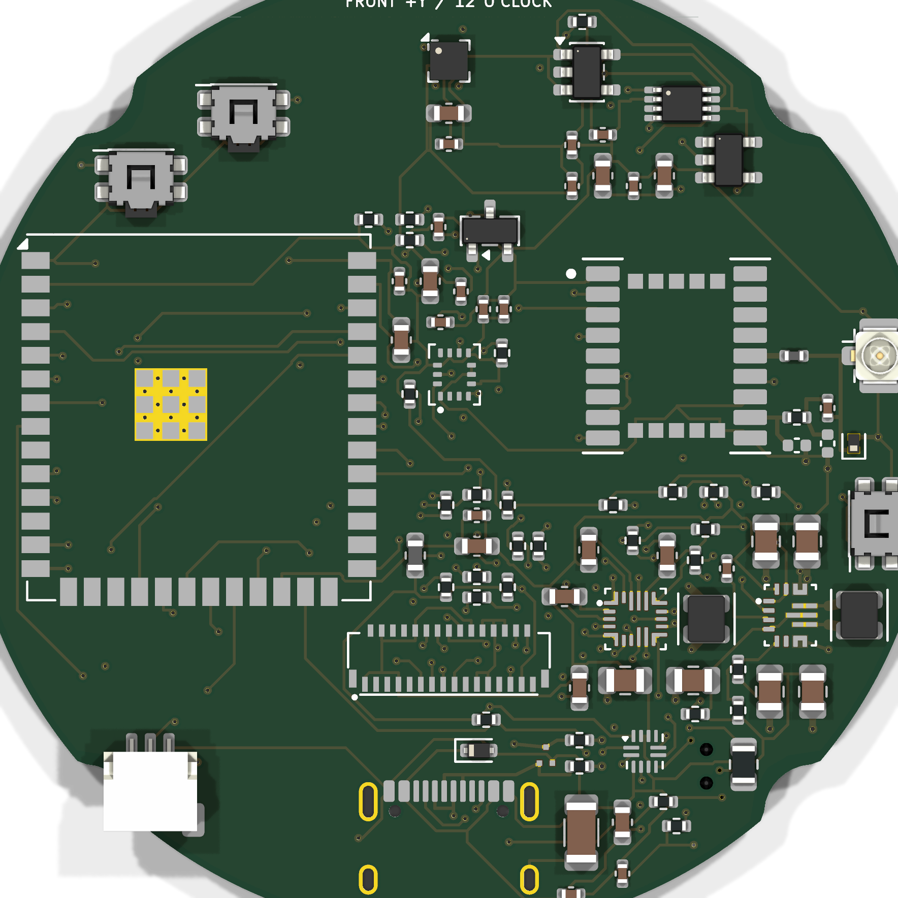

# MOTO GPS · Waveshare Edition



**想自己做一台微雪版？从 [购买、固件烧录与 iPhone 安装教程](docs/WAVESHARE_DIY_GUIDE.md)开始。**

[功能与使用说明书](docs/USER_MANUAL.md) · [真实导航网关配置](docs/GATEWAY_SETUP.md)

当前提供源码自行编译安装；尚无仓库发布的预编译固件、App Store / TestFlight 下载入口。
教程包含设备选型、原厂备份、Xcode 个人签名、配对、演示与常见问题。

**作者：Maler X · 署名 / 非商业使用 · 实验性样机**

一块装在车把上的圆屏，一个放在包里的 iPhone。手机负责定位、搜索与路线计算，
圆屏通过蓝牙显示简洁导航、速度、相对航向，并遥控 Apple Music。

项目基于 **Waveshare ESP32-S3-Touch-AMOLED-1.75C**，
包含圆屏固件、iOS App、路线网关和网页调试工具。

仓库同时收录自研电路板、V3 外壳、加工审阅资料和完整产品技术方案。
当前运行版本仍是微雪成品板 + iPhone；自研部分按历史工程候选归档，具体版本见下方资料入口。
首图为产品外观效果图，实物与加工尺寸请以对应版本的工程文件为准。

出发前在手机上搜索目的地、比较路线；开始导航后，车把上的圆屏显示眼前路口、
转向动作和距离。地图围绕固定的车头箭头移动，灰色道路和建筑提供周围环境参照。
滑动屏幕，还可以查看速度、航向，或操作 Apple Music。

[功能详解](#功能详解) · [使用流程](#使用流程) · [硬件与开发环境](#硬件与开发环境) ·
[安装与配置](#安装与配置) · [开发与测试](#开发与测试) · [使用许可](#使用许可与署名)

[产品参数](docs/PRODUCT_SPECIFICATIONS.md) · [电路板与外壳](hardware/README.md) ·
[技术方案 PDF / DOCX](docs/technical-proposal/README.md) · [资料总目录](docs/PROJECT_DOCUMENTATION.md)

## 电路板、外壳与产品资料

| 资料 | 包含内容 | 入口 |
| --- | --- | --- |
| 产品说明与技术参数 | 微雪样机与自研 A1 对照、显示与通信、结构尺寸、数据来源与验证状态 | [产品参数](docs/PRODUCT_SPECIFICATIONS.md) |
| H0175 EVT A1 自研主板 | KiCad 原理图与四层 PCB、项目符号封装库、BOM/CPL、Gerber/钻孔、装配图、ERC/DRC 和 SHA-256 | [A1 完整审阅包](hardware/manufacturing/engineering-candidates/rev-a1-h0175-evt1-20260903/README_DO_NOT_ORDER.md) |
| Rev A0 R4 主板 | A1 之前的路由基线与完整电气审阅资料，保留早期修订供比较 | [R4 审阅包](hardware/manufacturing/engineering-candidates/rev-a0-20260903-r4/README_DO_NOT_ORDER.md) |
| V3 自研外壳 | 参数化 CAD、前框/后壳/卡口 STEP 与 STL、装配模型、二维图、结构规格及外观渲染 | [V3 文件说明](hardware/mechanical/README.md) |
| 产品技术方案 | H0175 EVT A1 与 Rev A0 两版 Markdown、PDF、可编辑 Word，附系统架构与产品配图 | [阅读与下载](docs/technical-proposal/README.md) |
| 审查与生成工具 | 器件封装审计、电气检查、候选包导出脚本及硬件发布检查测试 | [硬件工具](scripts/hardware/README.md) |

自研 A1 使用 Ø52 mm 四层板，历史方案集成 ESP32-S3、LC76G、IMU、磁力计和
充电电源；V3 外壳名义主体 Ø61 × 16 mm，含卡口约 19 mm。这些参数属于自研
设计资料，与当前微雪板的尺寸和器件配置分开列出。A1、R4 均为工程审阅版本，
保留原有 `DO NOT ORDER` 标识；上传资料不代表恢复打样或已完成生产验收。




## 目前有什么

| 模块 | 功能 |
| --- | --- |
| 圆屏导航 | 白色路线、下一动作图标与距离；有可信限速数据时显示限速牌 |
| iPhone | 位置偏置搜索、搜索历史、路线预览与候选选择 |
| 导航逻辑 | 共享 C++ 核心，路线进度、偏航检测、联网重算与周期路线/路况刷新 |
| 灰色道路 / 建筑 | iPhone 内置 OSM 济南离线矢量库，按当前位置裁剪后传给圆屏 |
| 马表 / 航向 | 手机定位提供速度与行驶方向，板载 QMI8658 辅助相对转向 |
| 音乐 | Apple Music 上一首、播放/暂停、下一首 |
| 动效 / 触摸 | 黑白 Logo 淡入淡出、连接状态过渡、滑动切页、指示点自动隐藏、PWR 长按关机 |
| 演示 | 济南大数据产业基地 D 栋附近 → 浪潮总部附近；在线请求与 OSM 离线回退明确区分 |

## 功能详解

### 圆屏导航：把下一个路口看清楚

导航页以黑色为底，白色路线和转向提示是画面的重点。466×466 的圆形显示区域中，
每种元素都有明确含义：

| 画面元素 | 表达的信息 |
| --- | --- |
| 固定车头箭头 | 当前行进位置的视觉锚点，指向屏幕前方 |
| 白色粗线 | 当前导航路线在附近的走向 |
| 灰色细线 | 周围道路的实际几何形状，帮助辨认路口、支路和道路关系 |
| 灰色建筑块 | OSM 中收录的建筑轮廓，提供街区和园区参照 |
| 左下动作图标 | 下一个路口的直行、左转、右转、掉头等动作 |
| 动作旁的大号距离 | 距离这个动作还有多远，按距离切换 `m` / `km` |
| 限速牌 | 路线数据提供可信限速时，显示对应的速度数值 |
| 底部圆弧 | 路线完成进度，颜色随当前路况状态变化 |

例如屏幕显示右转箭头和 `300 m`，意思就是沿当前路线行驶约 300 米后右转。
接近路口时，距离逐渐减少；通过路口后，图标和数字更新为下一项指引。

行驶和转弯时，路线、周边道路和建筑使用同一组位置、航向和缩放参数。
车头箭头保持固定，地图在它下面平移、旋转，便于连续观察前方道路。
圆屏聚焦当前路段，出发前的全程路线由 iPhone 的预览地图展示。

### 地点搜索与路线选择

iPhone App 使用高德地点搜索与普通驾车路线服务。搜索时会带上手机当前位置，
优先呈现附近、相关度较高的地点。在济南输入“奥体中心”这样的关键词即可开始检索，
也可以输入带城市名的外地地点。

搜索与选路流程包括：

- 输入至少两个字开始搜索，连续输入时合并请求，按最新关键词更新结果。
- 搜索结果显示地点名称、地址或所在区域；有当前位置时可展示距离。
- 选择地点后保存到最近地点列表，按使用顺序保留 **8 条**，重启 App 后继续保留。
- 点击最近地点可重新规划前往该处的路线，也可以一键清空历史。
- 规划前刷新起点位置，再向网关请求候选路线。
- 按高德实际返回结果提供 **最多 3 条路线**，以推荐路线、备选路线展示。

路线确认页会显示起点、终点和整条路线。选中的路线高亮，其余候选以浅色显示。
下方卡片列出各条路线的距离、预计时间和分段路况摘要，例如“路况顺畅”“部分路段缓行”。
点击卡片切换方案，确认后再点击“开始导航”。

开始时会将选中的路线交给导航核心；如果预览后起点已经明显移动，程序会从当前位置
重新规划。路线确认与真机显示的一致性是当前持续回归测试的项目之一。

### 行驶中的导航更新

导航核心根据连续定位更新路线进度、下一动作距离、剩余路程和预计剩余时间。
手机导航页同时显示目的地、圆屏连接状态、定位状态与当前路况。

偏航判断结合偏离距离与连续定位确认。满足条件后，App 发起重新规划，
取得新路线后将指引同步给圆屏。路况通过周期请求刷新；核心默认配置约每 60 秒
发起一次更新，实际请求节奏还受网络状态、重试和服务配额影响。

定位质量、请求编号、路线版本都参与状态更新。手机保留当前导航状态，
圆屏重新完成连接和协议握手后，程序会尝试补发最新路线与显示数据。
后台连接和跨城路线的验证进展集中记录在[开发进度](#开发进度)。

### 济南离线道路与建筑

背景小地图使用 OpenStreetMap 矢量数据。项目内置一份按济南市行政边界裁剪的
SQLite 地图库，保存道路折线和建筑外轮廓。

| 当前内置数据包 | 数量 |
| --- | ---: |
| 文件体积 | 9.73 MiB |
| 道路折线 | 47,468 条 |
| 道路节点 | 266,985 个 |
| 建筑轮廓 | 26,702 个 |
| 建筑节点 | 148,140 个 |

地图库随 App 安装在 iPhone 中。导航时，手机利用 SQLite R-tree 查询车辆周围
约 500–800 米范围的要素，按距离、道路等级和显示容量筛选，再通过 BLE 发给圆屏。
车辆前进后，查询窗口随位置滚动。

目前单个显示窗口最多容纳 24 条背景道路、192 个道路点，以及 16 个建筑、128 个建筑点。
这种分工让手机保存完整区域数据，圆屏负责绘制当前视野。地图密度取决于当地 OSM
收录情况、要素筛选策略和窗口容量；建筑覆盖较完整的区域会有更丰富的街区细节。

路线规划与路况由在线高德服务提供，灰色环境图层来自本地 OSM 库。
当前背景数据覆盖济南，扩展到其他城市时，可以沿用仓库的提取、生成和校验工具。
数据格式、生成命令和署名要求见[离线地图说明](shared/offline_map/README.md)。

### 马表与航向页

马表页以大号数字显示当前速度，单位为 `km/h`，外圈刻度和圆弧随速度变化。
页面围绕实时速度设计，适合在圆屏上快速读取。

航向页显示角度、方位字母、旋转刻度和当前速度。手机定位提供行驶方向，
圆屏上的 QMI8658 六轴传感器提供短时角速度，用于补偿转动过程中的显示变化。

手机放在包里时，行驶方向取自位置运动产生的 `CLLocation.course`；
圆屏的相对转角取自设备自身陀螺仪。低速或静止时以相对转角为参考，
恢复行驶后再由定位航向逐渐校正。静止绝对北向属于后续磁力计扩展的范围。

### Apple Music 控制

音乐页通过 iPhone 的系统音乐播放器控制 Apple Music，显示音乐来源、曲目标题、
歌手和播放状态。圆屏提供上一首、播放/暂停、下一首三个操作按钮。

首次使用时，在 iPhone 上授权媒体资料库访问，并在 Apple Music 中准备好播放队列。
触摸圆屏按钮后，命令经 BLE 发送到手机；播放器处理动作后，最新曲目与状态再回传圆屏。
手机授权状态和播放器状态决定音乐功能的可用情况。

声音继续沿用 iPhone 当前的音频输出，例如头盔蓝牙耳机。圆屏承担显示与遥控，
适合与手机现有的音乐播放方式搭配使用。

### 开机、连接与触摸交互

上电后先显示黑白 `MOTO GPS` Logo，经过淡入、停留和淡出进入连接界面。
面板在纯黑首帧准备好后点亮，减少启动闪白。

```text
开机 Logo → 准备连接 / 连接中 → 绿色连接成功 → 准备出发 → 导航画面
```

准备连接时显示连接图形和动画；协议握手完成后，绿色成功状态停留约 0.9 秒，
再进入准备出发页，提示到手机选择目的地。开始规划与取得路线时，页面继续随状态切换。

- 左右滑动切换导航、马表、航向、音乐页面；音乐页按手机能力开放。
- 底部指示点用于识别当前页面，停留五秒后自动隐藏。
- 触摸或换页后，指示点重新出现。
- 侧面 PWR 按住约三秒，显示关机画面并向 AXP2101 请求关机；USB 供电场景还有深睡处理。

### 演示导航

App 提供“演示导航”入口，使用以下公共地点作为固定演示场景：

**济南大数据产业基地 D 栋附近 → 浪潮集团总部附近。**

联网演示优先请求当次高德路线，再沿返回的路线几何连续生成模拟位置。
离线回退使用随仓库提供的 OSM 路线，经过园区车道、新泺大街、崇华路和浪潮路，
全长约 1.49 公里。演示位置同样经过导航核心、BLE 协议和圆屏 UI。

坐在桌前即可观察动作图标与距离的对应关系、地图滚动、转弯旋转、周边灰路与建筑，
也能检查连接状态切换和页面排版。Web 工具提供同源界面的浏览器预览。
演示数据的道路来源、生成方式和 OSM 署名见[演示夹具说明](shared/demo_fixture/README.md)。

## 使用流程

完成首次安装和配置后，一次导航按下面的顺序操作：

1. 给圆屏上电，在 iPhone 上打开 MOTO GPS。
2. 查看连接状态；首次配对时按 iOS 提示完成蓝牙配对和权限授权。
3. 输入目的地，或者从最近地点中选择一个终点。
4. 在全程地图中查看路线，比较候选卡片的距离、用时与路况。
5. 选择路线并点击“开始导航”，手机开始更新位置，圆屏显示当前路段和下一动作。
6. 停车时可滑动查看马表、航向和音乐页面，按需切歌。
7. 到达后查看到达状态，在手机上结束导航；收车时长按圆屏 PWR 关机。

iPhone 提供网络和定位，圆屏通过 BLE 连接手机。当前后台连接可靠性仍在验证中，
请先在安全静止环境完成锁屏、恢复连接和状态同步测试。
调试及操作请停车后进行，行驶时请结合成熟导航软件核对路线。

## 硬件与开发环境

### 终端硬件

| 项目 | 当前适配 |
| --- | --- |
| 开发板 | Waveshare ESP32-S3-Touch-AMOLED-1.75C |
| 主控 | ESP32-S3 |
| 存储 | 32 MB Flash、8 MB PSRAM |
| 显示 | 1.75 英寸圆形 AMOLED，466×466 |
| 显示驱动 | CO5300，QSPI，RGB565 |
| 触摸 | CST9217 电容触摸 |
| 运动传感器 | QMI8658 六轴 IMU |
| 电源管理 | AXP2101，USB-C / 配套锂电池 |
| 手机连接 | BLE，自定义导航 GATT 服务 |

准备一条支持数据传输的 USB-C 线。使用电池时，按微雪对 **1.75C** 的规格、
插头和极性要求选择。刷写前请核对完整板型；板级连接与固件步骤见
[ESP32 说明](platforms/esp32/README.md)。

### 软件工具

| 用途 | 环境 |
| --- | --- |
| iPhone App | iOS 17+；Mac、Xcode 16+ / Swift 6 工具链、XcodeGen |
| 圆屏固件 | ESP-IDF **5.5.5**，Waveshare BSP **3.0.0** |
| 共享 UI | LVGL **9.5.0 对应固定提交** |
| 路线网关 | Node.js 20+；建议 Node.js 24+ 运行本文配置示例 |
| C++ 测试 | CMake、支持 C++17 的编译器 |
| Web 预览 | Emscripten、CMake、HTTP 静态服务器 |
| 地图重建 | Node.js 24+、osmium-tool、jq |

真实导航需要配置自己的高德 Key、HTTPS 网关和 Apple 开发者签名。

## 安装与配置

### 1. 获取源码

```sh
git clone --recurse-submodules https://github.com/mx3353672833-debug/moto-gps-waveshare.git
cd moto-gps-waveshare
```

上述命令会同时获取固定版本的 LVGL。使用 GitHub 的 Download ZIP 时，
还需将 LVGL 提交 `85aa60d18b3d5e5588d7b247abf90198f07c8a63` 的源码放入 `third_party/lvgl/`。

下面的命令均以仓库根目录为起点。

### 2. 配置路线网关

网关将 App 的搜索和路线请求转换为高德 Web 服务请求，再返回统一格式的导航数据。
高德 Key 保存在服务端环境变量中。

先运行后端自动测试，再创建自己的配置文件：

```sh
npm --prefix backend test
cp backend/.env.example backend/.env
```

编辑 `backend/.env`：

| 配置项 | 填写内容 |
| --- | --- |
| `MOTO_PROVIDER` | 真实导航填写 `amap`；本地协议测试用 `fixture`；待配置服务用 `disabled` |
| `AMAP_WEB_SERVICE_KEY` | 自己申请的高德 Web 服务 Key |
| `PORT` | 后端监听端口，默认 `8787` |
| `WEB_ORIGIN` | 使用 Web 工具时填写网页的实际 Origin |

用 Node.js 24+ 显式加载配置并启动：

```sh
node --env-file=backend/.env backend/src/server.js
```

服务默认监听 `127.0.0.1:8787`。部署时，用自己的 HTTPS 反向代理把
`/moto-gps/api/` 转发到这个服务，供手机访问。
检查 `/healthz` 中的 `provider` 为 `amap`、`ready_for_live_navigation` 为 `true`，
再完成一次真实地点搜索与路线请求，确认账号权限、配额和网络。

对公网部署时，请配置访问控制、TLS、配额限制和日志脱敏。
完整 API 与部署说明见[路线网关文档](backend/README.md)。

### 3. 构建并安装 iPhone App

编辑 `platforms/ios/project.yml`，设置：

- `MOTOGPSGatewayBaseURL`：自己的 HTTPS 网关地址，例如 `https://YOUR-DOMAIN/moto-gps/api/`。
- `PRODUCT_BUNDLE_IDENTIFIER`：自己可用的唯一标识；App 与两个测试目标分别设置。
- `DEVELOPMENT_TEAM`：自己的签名团队，也可以在 Xcode 中选择。

App 默认网关为示例地址 `https://example.invalid/moto-gps/api/`，使用前替换成自己的服务。
配置来源是 `project.yml`，XcodeGen 会据此更新工程与 `Info.plist`。

```sh
(cd platforms/ios && xcodegen generate)
open platforms/ios/MotoGPS.xcodeproj
```

连接并信任自己的 iPhone，按 Xcode 提示启用开发者模式，选择 MotoGPS scheme、
自己的设备和签名团队，再点击 Run 安装。
首次运行按提示允许定位、精确位置、蓝牙及所需媒体权限。
详细步骤和签名说明见[iOS 文档](platforms/ios/README.md)。

### 4. 构建并刷入圆屏

安装、激活 ESP-IDF 5.5.5 环境后执行：

```sh
idf.py -C platforms/esp32 set-target esp32s3
idf.py -C platforms/esp32 build
```

构建会获取固定依赖，在 `platforms/esp32/build/` 生成应用、bootloader 和分区表。
首次刷写前，按[固件文档的备份步骤](platforms/esp32/README.md#备份和刷写)
核对型号、Flash 容量和安全状态，保存原厂完整备份。

确认备份完成并接受替换原厂应用后，将 `PORT` 换成实际 USB 串口：

```sh
idf.py -C platforms/esp32 -p PORT flash monitor
```

设备启动后以 `MOTO GPS` 广播。打开 iPhone App 完成配对与握手，
圆屏进入准备出发页后，即可按照上面的使用流程选择路线。

### 5. 在浏览器预览界面

安装并激活 Emscripten 后，构建共享 LVGL WebAssembly 运行时：

```sh
./scripts/build_web.sh
python3 -m http.server 4173 --directory .
```

浏览器打开：

```text
http://127.0.0.1:4173/platforms/web/shell/index.html?demo=1
```

也可以分别预览连接状态，把查询参数改为 `?deviceState=connecting`、
`?deviceState=success`、`?deviceState=ready` 或 `?deviceState=planning`。
这些状态使用共享 LVGL 界面渲染，适合开发时检查动画和排版。

查看和调试界面可用 [Web 调试工具](platforms/web/shell/README.md)，使用时保持网页前台亮屏。
手机后台定位和 BLE 连接由 iOS App 负责，当前验证进度见[已知问题](docs/KNOWN_ISSUES.md)。

## 实现方式

iPhone 负责位置、完整路线和地图数据库，ESP32 负责接收显示状态、处理本机运动输入、
绘制圆屏和回传触摸命令。后端负责高德服务调用与数据格式转换。

```text
高德 Web 服务 ←→ HTTPS 路线网关 ←→ iPhone App
                                      │
                Core Location + 共享导航核心 + 济南地图查询
                                      │ BLE
                                      ▼
                   ESP32 接收状态 + QMI8658 相对转向
                                      │
                           NavPresenter → LVGL → 圆屏

圆屏触摸 / 音乐操作 ─────── BLE ───────→ iPhone
```

### 共享导航与界面

路线进度、偏航状态和显示数据结构放在共享 C++ 模块中。iOS 通过 Objective-C++ 桥接调用
导航核心；Web 和 ESP32 共同编译 `NavPresenter` 与 LVGL UI。
调整圆屏布局、动作图标或地图绘制时，可以先用 Web 观察，再在实机验证。

完整路线保存在手机端，圆屏接收当前视野所需的路线几何与周边环境窗口。
请求位置使用 WGS84，导航几何统一为 GCJ-02；地图预览按平台坐标要求进行转换。
相关约定见[架构说明](docs/ARCHITECTURE.md)和[路线协议](shared/protocol/README.md)。

### BLE 数据与连接

设备以 GATT peripheral 工作，iPhone 作为 central 连接。
协议包含连接状态、心跳、导航快照、路线几何、路况、道路/建筑窗口、媒体状态和设备命令。

传输层实现分片重组、CRC 校验、消息序号、会话隔离、控制命令 ACK 与超时重试。
手机到圆屏的导航快照最高按 5 Hz 调度，位置和转向动画由终端进一步插值。
配对采用加密 BLE 连接与 bonding；连接恢复仍在持续测试。
GATT UUID、字节格式与黄金测试数据见[BLE 协议](shared/protocol/ble-navigation-v1.md)。

### 显示与流畅度

固件使用两个 466×32 的 RGB565 PSRAM 绘图缓冲，让 LVGL 绘制和 QSPI 传输衔接。
CO5300 的 TE 信号用于帧首同步，地图、插值和渲染任务按 25 ms 的目标节拍协调。
实际帧率、快速转向时的撕裂感和持续运行功耗，仍以实机测量与观察为准。

## 源码结构

```text
platforms/ios       iPhone 定位、路线预览、BLE、Apple Music、离线场景查询
backend            Node.js 高德 Web 服务网关（Key 只在这里）
platforms/esp32     Waveshare 板级适配、BLE、QMI8658、显示与电源
shared             共享导航核心、协议、LVGL UI、OSM 演示及地图数据
platforms/web      LVGL / Wasm 调试外壳
tests              C++ 原生测试
scripts            Web 构建、字体与 OSM 地图工具
```

详见 [架构与数据边界](docs/ARCHITECTURE.md)、[测试方式](docs/TESTING.md)、
[已知问题](docs/KNOWN_ISSUES.md)、[第三方许可证](THIRD_PARTY_NOTICES.md)。

## 开发与测试

### 运行自动测试

在仓库根目录执行：

```sh
cmake -S . -B build/native -DMOTO_BUILD_WEB=OFF -DMOTO_BUILD_TESTS=ON
cmake --build build/native --parallel 4
ctest --test-dir build/native --output-on-failure

npm --prefix backend test
swift test --package-path platforms/ios

node scripts/generate_jinan_demo_fixture.mjs --check
node scripts/offline_map/validate_jinan_sqlite.mjs
```

首次公开快照已通过 8 组 C++ 原生测试、33 项后端测试、10 项 Swift 核心测试，
以及演示夹具一致性、地图数据库完整性检查。ESP32、iOS App 和 Web 也已完成构建。
环境与结果见[发布检查记录](docs/RELEASE_CHECKS.md)，后续提交的检查结果见
[GitHub Actions](https://github.com/mx3353672833-debug/moto-gps-waveshare/actions/workflows/checks.yml)。

### 从哪里开始修改

| 想调整的内容 | 主要入口 |
| --- | --- |
| 圆屏布局、颜色、图标、状态动画 | `shared/nav_ui/src/moto_nav_ui.cpp` |
| 地图投影与显示数据转换 | `shared/nav_presenter/src/moto_nav_presenter.cpp` |
| 偏航、到达、定位有效期和路况刷新默认配置 | `shared/nav_core/nav_core.hpp` 中的 `NavCoreConfig` |
| 手机搜索、历史记录、路线确认流程 | `platforms/ios/App/AppModel.swift`、`ContentView.swift` |
| 全程路线地图与候选展示 | `platforms/ios/App/RouteOverviewMap.swift` |
| BLE 握手、发送调度与恢复连接 | iOS 的 `ESP32BLECentral.swift` 与 ESP32 的 `ble_nav_transport_nimble.cpp` |
| 当前窗口道路与建筑筛选 | `platforms/ios/App/Adapters/OfflineMap/` |
| Apple Music 遥控 | `platforms/ios/App/Adapters/Media/AppleMusicRemoteController.swift` |
| CO5300 显示、TE 同步与电源 | `platforms/esp32/main/board_port_waveshare_1_75c.cpp` |
| 地图数据重建 | `scripts/offline_map/` |

修改协议时请同步更新两端实现和 golden fixture；修改地图时保留 OSM 来源、许可和署名。
贡献流程见[CONTRIBUTING](CONTRIBUTING.md)。

## 开发进度

当前版本处于实机验证阶段，接下来重点回归：

- iPhone 锁屏、切换网络和离开原环境后的 BLE 连接恢复。
- 跨城候选路线生成，以及手机选中路线与圆屏显示的一致性。
- 快速转向时的刷新连续性、TE 同步表现和持续帧率。
- USB、电池及组合供电下的关机、唤醒、续航和温升。

功能说明描述的是当前源码实现；实机验收状态与复现记录以
[已知问题](docs/KNOWN_ISSUES.md)为准。提交问题时请附上板型、固件版本、iOS 版本、
复现步骤与脱敏日志，便于区分定位、网关、协议和显示环节。

## 使用许可与署名

项目原创代码和设计素材使用 **[PolyForm Noncommercial 1.0.0](LICENSE.md)**。
允许许可范围内的个人学习、研究、非商业使用和修改；分发源码、修改版、固件或 App
时必须携带许可证及 [NOTICE](NOTICE) 中的作者声明，注明 **Maler X** 和本仓库来源。
App 待机界面和 Web 状态页也提供可见署名入口。

**仅限非商业使用。** 销售预装设备、收费分发固件、用于商业产品或收费服务等用途，
须另行联系作者取得商业授权。具体授权范围以 LICENSE.md 正文为准。

授权类型为 **source-available（公开源码、非商业授权）**。
第三方库、字体和 OSM 数据分别遵循原许可证；地图服务须按服务商协议使用。

© 2026 Maler X · 地图数据 © OpenStreetMap contributors（ODbL 1.0）。
