# MOTO GPS 摩托车便携导航终端技术方案（Rev A0 R4）

版本：2026-09-03  ·  状态：功能原型 / Rev A0 R4 电气工程候选  ·  NOT FOR FABRICATION

> **历史冻结交付文档，不代表当前软件样机。** 本文保留 Rev A0 R4 的“独立 GNSS + 手机热点”假设，用于追溯硬件候选，禁止据此执行当前联调或下单。当前基线是 Waveshare 1.75C + 原生 iOS App：手机负责真实定位、按当前位置优先的地点搜索和高德路线，ESP32 通过 BLE 显示；App 测试版及固件导航页长按均有明确标注的演示入口，生产导航仍使用真实路线，iOS BLE 恢复握手/重连的已知实现问题已修复。见 [微雪 + iPhone 样机基线](../WAVESHARE_IOS_PROTOTYPE.md)。配套 PDF/DOCX 是同一历史归档，未随当前软件基线重写。

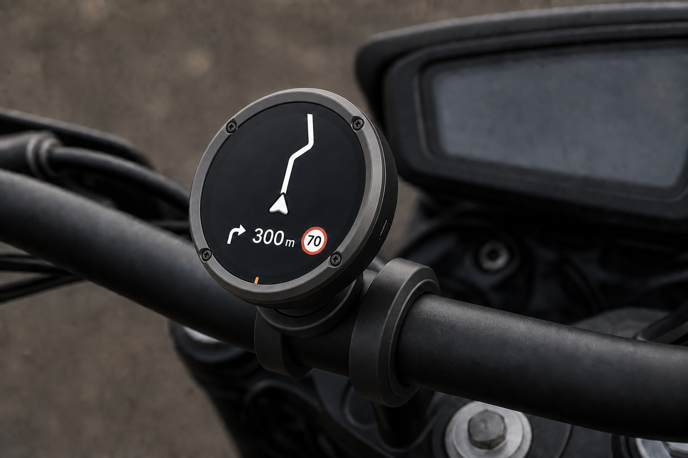

## 执行摘要与结论

MOTO GPS 是一款安装在摩托车车把上的圆形专用导航终端。手机只提供热点网络和目的地输入；导航开始后，终端持续完成定位、车头航向、路线推进、偏航判断、画面渲染和断网续航。

### 核心结论

功能原型可行；Rev A0 R4 已形成完整原理图、四层布线和审阅制造文件，但首板仍必须先关闭 FPC、USB-C、电源、RF、采购和整机结构门槛。纯 Safari/PWA 无法满足 iPhone 锁屏后持续定位，因此正式路径必须保留终端独立 GNSS。

### 不是 CarPlay 投屏

设备不镜像手机画面、不运行 Android、不读取高德或百度通知。高德负责道路、路线和路况；终端自己确定当前位置和车头方向。

| 判断项 | 结论 | 边界 |
| --- | --- | --- |
| 网页版功能原型 | 可行 | 前台定位与路线模拟已具备 |
| 手机锁屏后持续导航 | 可行 | 依赖终端 GNSS，不依赖网页后台 |
| 实时路况 / 偏航重算 | 可行 | 终端通过手机热点请求后端 |
| Rev A0 R4 主板 | 中高 | ERC/DRC/未连接/一致性均为 0；未解除实物门槛 |
| 佳明底座直装 | 中高 | A0 已建模；原装底座量规待实物验证 |
| 一次设计直接量产 | 不可承诺 | RF、罗盘、电源、密封与振动需实测 |

> 当前最大难点不是 ESP32 算力，而是 Ø61 mm 小体积内的 GNSS 天线、罗盘磁环境、电源热、密封与机械公差。

## 产品定位与目标使用场景

目标用户是城市通勤与中短途骑行者：不把手机固定在车头，仍能获得简洁、连续、可重算的逐向导航。

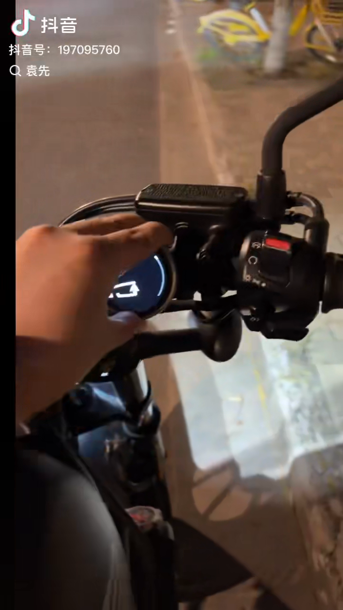

- 上车后手机开启热点，终端自动联网。
- 用户在手机网页搜索目的地并下发到终端。
- 导航开始后手机锁屏放入包内，网页无需保持前台。
- 终端独立获取位置、速度和车头航向；箭头固定朝屏幕上方。
- 偏航时终端自动请求新路线；路况按周期刷新。
- 网络中断时沿缓存路线继续，网络恢复后补做重算与路况刷新。

> 图示为用户提供的目标场景参考，不是本项目成品实拍。

## 产品功能边界

首版聚焦导航、马表、指南针和触摸分页；音乐遥控是附加能力，不影响核心导航验收。

### 明确不做

不复制完整 CarPlay；不镜像手机；不安装 Android；不显示复杂地图瓦片与大量 POI；不依赖手机摆放朝向；不把扬声器和麦克风列为必需硬件。

| 功能 | 用户看到的结果 | 实现方式 | 当前状态 |
| --- | --- | --- | --- |
| 逐向导航 | 箭头朝上，路线随车头旋转 | NavCore + LVGL | 共享逻辑与首版 UI 已完成 |
| 目的地搜索（历史方案） | 手机网页文本搜索 POI | 自有后端 + 高德 POI | 当时链路完成；当前 App 已改为按手机位置优先的附近搜索，近场无结果再回退 |
| 路线 / ETA | 距离、时间、道路和转向 | 高德驾车 Route v2 | 样机可用，授权边界待确认 |
| 偏航重算 | 走错路后自动换新路线 | 终端判断 + 后端重算 | 状态机完成，实车待测 |
| 实时路况 | 拥堵和 ETA 周期更新 | 首版 60 s 刷新 | 逻辑完成，配额与收益待测 |
| 马表 | 实时速度 / 圆周刻度 | GNSS speed | UI 已完成 |
| 指南针 | 车头方位而非手机方位 | GNSS + IMU + LIS2MDL | 融合与校准待实机 |
| 音乐 | 播放、暂停、上下曲 | BLE HID；iPhone 可选 AMS | 附加功能，实机待测 |
| 喜欢歌曲 | 能力存在时显示 | AMS LikeTrack | 不作为必达验收项 |

## 圆屏交互与导航模拟

四个页面均来自当前共享 LVGL / WASM 运行画面，不是静态效果图。导航页已经能够在固定路线夹具上模拟推进。

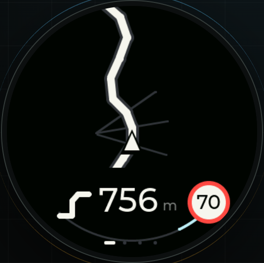
*导航：下一转向 / 距离 / 限速*

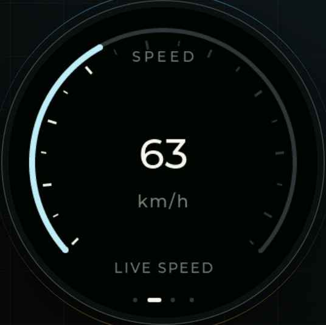
*马表：实时速度与圆周刻度*

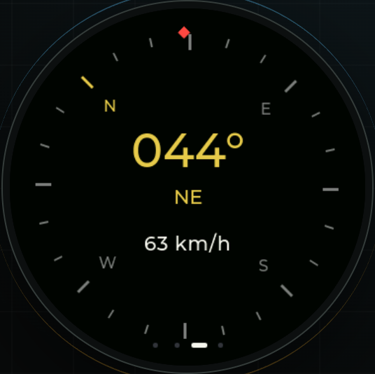
*指南针：车头绝对方位*

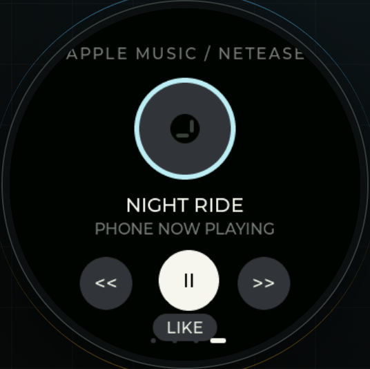
*音乐：基础遥控，附加功能*

- 深黑底、粗白路线、少量冷色状态光，强光下优先可读性。
- 车辆箭头位于圆心略下并固定朝 12 点，地图按车头反向旋转。
- 左右滑动切换页面，触摸热区按至少 44 × 44 逻辑像素设计。
- Web 与 Waveshare 正式屏 framebuffer 已同源统一为 466 × 466；后续仍需用实屏检查字体、裁切和 golden frame。

## 端到端系统架构

独立 GNSS 解决手机锁屏定位；手机热点解决高德路线、路况和偏航重算的数据连接。

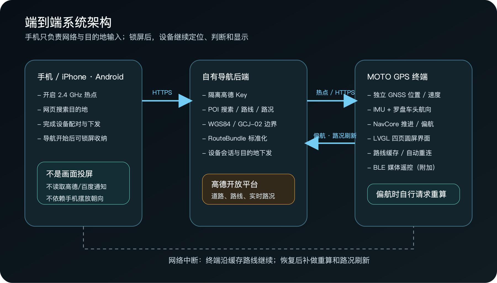

### 目的地下发

终端显示短配对码或二维码；手机网页把终端 ID 与会话关联，确认目的地后写入服务端，终端通过 HTTPS 取回目的地与标准化路线。

### 安全边界

高德 Key 只保存在后端；终端和网页只接触项目定义的 RouteBundle。旧请求返回不得覆盖更新路线。

## 导航执行与锁屏可行性

正式产品不是让 Safari 在后台持续导航，而是让终端在网页退出后继续导航。

### 偏航初始参数

定位精度优于 50 m 才参与判断；距路线超过 45 m 且连续 3 个可靠样本后重算；回到路线 25 m 内清除偏航确认。参数需通过高架、辅路和城市峡谷日志调整。

### 断网行为

网络中断时继续显示缓存路线和本地推进；无法取得新路线或新路况。热点恢复后自动重连，优先处理待重算，再刷新路况。

### 坐标边界

GNSS 原始 WGS84 坐标进入高德路线服务前，必须经过显式 WGS84 / GCJ-02 转换；转换只存在于清晰定义的适配边界。

| 方案 | 锁屏持续定位 | 偏航重算 | 结论 |
| --- | --- | --- | --- |
| 纯 Safari / PWA | 不可靠 | 不可靠 | 仅作前台功能验证 |
| 读取高德 / 百度通知 | 数据不完整 | 无法稳定实现 | 不采用 |
| 手机原生 App 常驻 | 可实现 | 可实现 | 成本与周期不接受 |
| 终端 GNSS + 手机热点 | 终端可持续 | 终端可自行请求 | 正式产品路径 |

## 车头航向：箭头始终朝前

手机放在包里不参与车头朝向。终端安装在车把上，融合 GNSS 航迹角、陀螺仪短时变化和磁力计低速绝对方向。

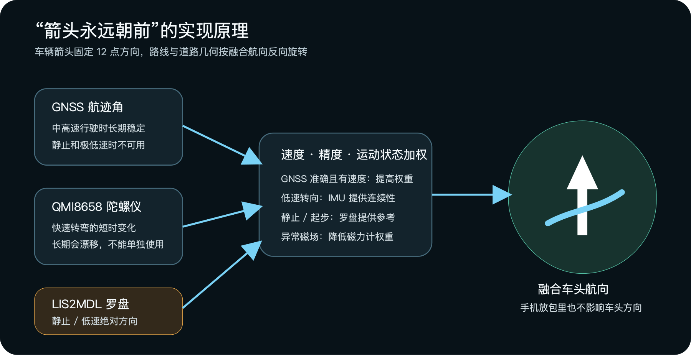

- GNSS 不能在静止时稳定给出朝向，罗盘不能给出位置，陀螺仪长期会漂移，三者必须互补。
- LIS2MDL 必须在最终 PCB、外壳、佳明底座、车把和摩托车通电状态下做软/硬铁校准。
- 钢螺钉、扬声器磁铁、电感和大电流回路会污染罗盘；V3 使用 TC4 螺钉、黄铜嵌件并取消扬声器。

## 网页与固件同源实现

网页不是视觉参考图，而是固件共享代码在浏览器中的运行目标。平台驱动不同，导航核心和 UI 不重写。

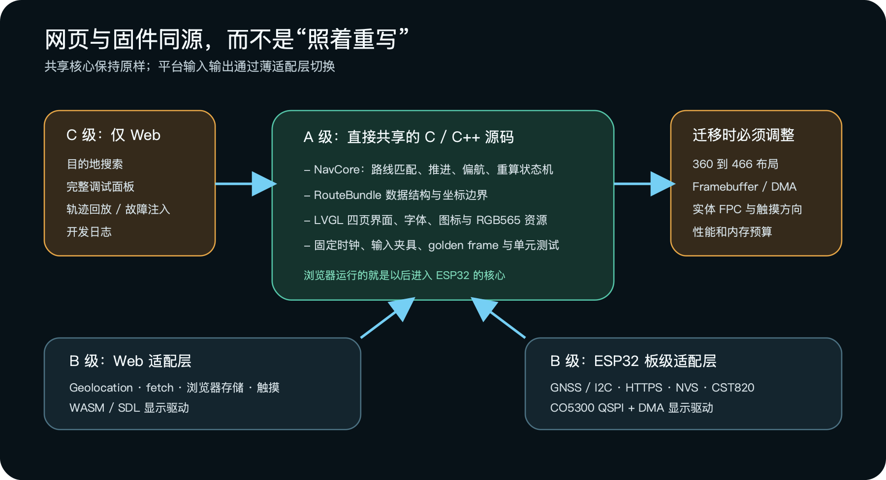

### A 级同源

导航核心、路线匹配、偏航状态机、LVGL 页面、字体、图标、RGB565 资源和测试夹具直接共享。

### B 级适配

Web Geolocation 对应实体 GNSS；fetch 对应 ESP32 HTTPS；浏览器存储对应 NVS；浏览器触摸对应 CST820。

### 仍需完成

真实 H0175Y003AMT003 V1、CO5300 QSPI、CST820、DMA 缓冲、466 × 466 framebuffer 和实机性能预算尚未接通。

## 自研硬件总体方案

不再在成品开发板内飞线扩展，而是以 ESP32-S3 圆形主板把 GNSS、IMU、罗盘、电源和屏幕接口一次集成。

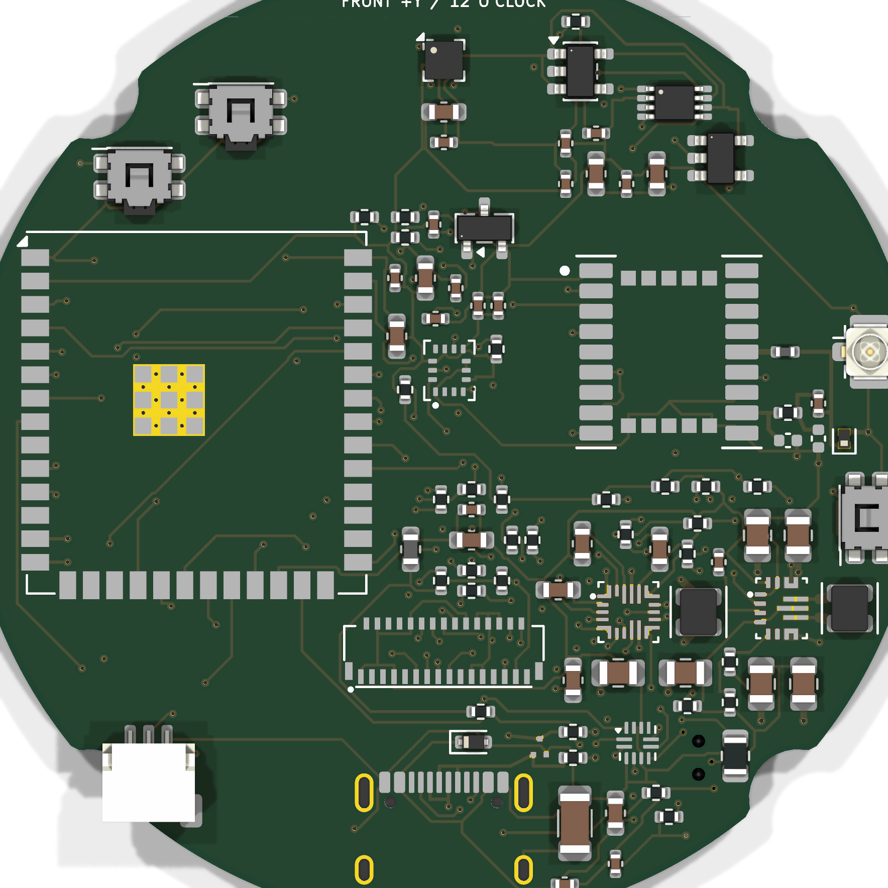

| 子系统 | 首选器件 / 方案 | 作用与边界 |
| --- | --- | --- |
| 主控 | ESP32-S3-WROOM-1U-N16R8 | 首板降低 LGA、Flash/PSRAM 与 RF 风险；16 MB Flash + 8 MB PSRAM |
| 显示 / 触摸 | H0175Y003AMT003 V1 / CST820 | 1.75 in 466×466 全贴合 AMOLED；CO5300 QSPI；单点触摸 |
| 屏幕互联 | 31P 模组接口 + 31P FFC（待实物） | Pin 1、接触面和端到端顺序以到货通断为准，不先验冻结直通/反向 |
| GNSS | LC76GABMD 裸模组 | 约 10 mm 见方，不是 150 元开发载板；UART / PPS |
| IMU / 罗盘 | QMI8658C + LIS2MDLTR | 转向动态 + 低速/静止绝对航向 |
| 电源 | BQ25628E + TPS63070 + TUSB320LAI | 充电 / NVDC、3.3 V 升降压、Type-C 电流识别 |
| 电池 | 702530 带保护 / NTC | 约 500 mAh 初始包络；续航以实测冻结 |
| 无线 | 2.4 GHz FPC + U.FL | 手机热点 / BLE；贴塑料后壳内侧 |
| 音频 | 不装 | 删除扬声器、麦克风、codec，减少空间和磁干扰 |

> 用户确定电池供电，不接摩托车 12 V；12 V 转 5 V、串联保险丝和车载防水电源接头不属于基本 BOM。

## 电源、PCB 与射频实现

Rev A0 R4 已完成完整电气连接、四层摆件布线和审阅制造导出；电源测试券、受控阻抗与整机 RF/热验证仍是投板放行门槛。

### 电源路径

USB-C 5 V → TUSB320LAI → BQ25628E ↔ 单节锂电池/NTC → TPS63070 3.3 V；GNSS 可由低噪声 3.0 V LDO 单独供电。

### 四层板基线

完整 Ø52 mm、1.0 mm、沉金；取消中央电池窗口，电池改为 PCB 后方绝缘叠放；四处 R2.7 月牙避让。F.Cu 放器件与短线，In1.Cu 优先连续地，In2.Cu 分配电源/低速信号，B.Cu 完成低速与测试网络。

### 器件分区

IMU 靠几何中心；磁力计靠 12 点最外缘；PMIC、USB、电池入口集中 6 点；2.4 GHz 与 GNSS RF 区分离。

| 电源测试券必须通过 | 验证内容 |
| --- | --- |
| R4 CAD | 93 个生产器件、458 焊盘、1555 段走线、189 个过孔、2 个覆铜区 |
| 启动与切换 | 无电池冷启动、USB/电池无缝切换、低电量复位 |
| 负载 | 1 A 持续、1.5 A 阶跃、Wi-Fi 脉冲负载 |
| 充电安全 | Type-C 三档能力、NTC 停充、短路恢复 |
| 热 | 密封环境温升、满载与同时充电降额 |

> KiCad 10.0.6 全轨检查结果：ERC 0、DRC 0、未连接 0、原理图/PCB 一致性错误 0。R4 同状态导出了 Gerber、钻孔、57 行分组 BOM 和 93 点 CPL；文件仍标记 NOT FOR FABRICATION，因为 28 个生产引用仍处于实物、电源、RF、库存或代采放行状态。

## V3 外观与结构方案

外观冻结为连续深灰喷砂铝前框、四颗对角外露功能螺钉、黑色圆形玻璃、右侧按键和 6 点琥珀色定位标。

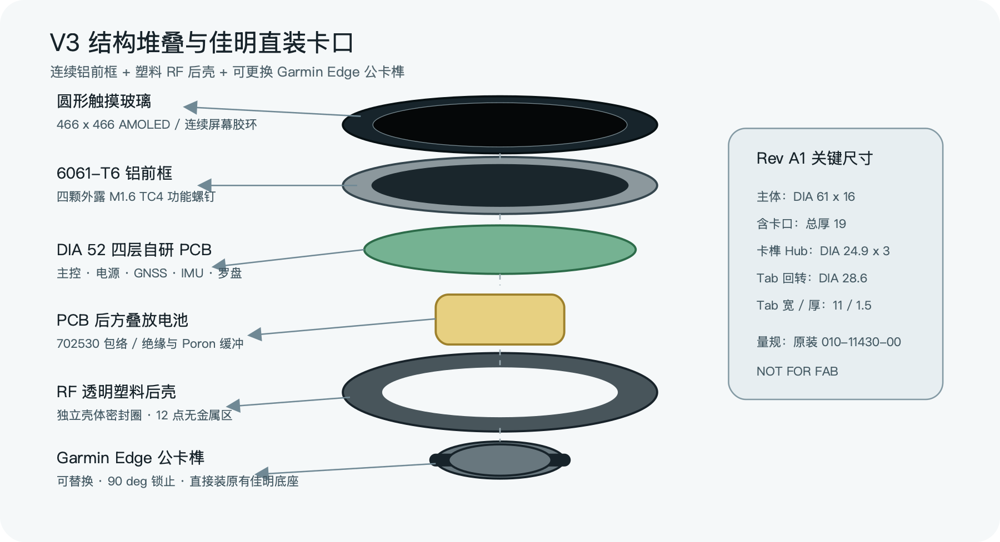

| 项目 | Rev A0 名义值 | 状态 |
| --- | --- | --- |
| 主体 | Ø61.0 × 16.0 | H0175 V1 几何基线 |
| 含佳明卡口 | 最大厚度 19.0 | 几何已验证 |
| 前框 / 后壳 | 6061-T6 3.0 / PC-ABS 13.0 | 材料路线 |
| 盖板 / 触摸可视 / 有效区 | Ø48.96 / Ø44.16 / Ø43.76 | 供应商 V1 图纸；实物待验 |
| PCB / 电池 | 完整 Ø52 × 1.0 / 27 × 32 × 7 | 电池在 PCB 后方绝缘叠放，厚度待实物复算 |
| 螺钉 | M1.6×6 TC4，R27.70 / PCD Ø55.40 | 跟随 Ø61 mm 包络更新 |

## 佳明 Edge 底座直装方案

设备背面采用 Garmin Edge 设备侧公卡榫，直接对准现有佳明底座缺口，轻压并旋转 90° 锁止；无需另做专用车把夹。

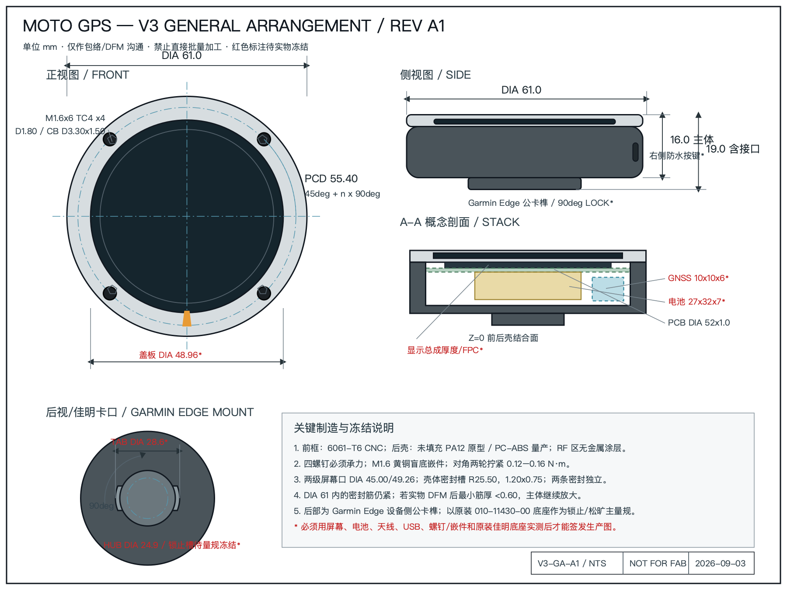

### A0 几何

中心导向柱 Ø24.9 × 3.0；两侧卡榫最大回转直径 Ø28.6；卡榫带宽 11.0；厚 1.5；整机总厚保持 19.0 mm。

### 可维护设计

公卡榫为独立可替换工程塑料件。跌落、磨损或缩水修正时只更换卡口，不报废整只后壳。

### 量规与验收

以 Garmin 原装 Quarter-turn Bike Mount P/N 010-11430-00 为主量规；覆盖 20 次拆装、拉拔、扭矩、振动、淋雨后松旷复测，并使用安全绳。

> Garmin 官方未公开完整生产公差图。当前尺寸是 A0 逆向包络，锁止槽、导入圆角和注塑缩水必须经原装底座实物冻结，不能直接宣称“百分百兼容所有第三方底座”。

## 可行性评估

方案没有原理性不可实现问题。风险集中在实物协同，而不是功能想法本身。

| 模块 | 可行性 | 现有证据 | 退出条件 |
| --- | --- | --- | --- |
| Web 目的地与路线 | 高 | 页面、网关、RouteBundle、共享核心已有 | 真实 Key 与道路长测 |
| 偏航 / 路况 | 高 | 单元测试和模拟链路已有 | iPhone / ESP32 实车验证 |
| ESP32 圆屏显示 | 高 | LVGL/WASM 与屏幕接口明确 | CO5300 / 466×466 性能 |
| 自研主板 | 中高 | R4 完整原理图/四层布线；全轨 DRC 与一致性均为 0 | 实物接口、电源/RF 审查后才可投首板 |
| 独立定位 | 中高 | 成熟 GNSS 模组与接口 | 天线、整机 RF、装车环境 |
| 车头航向 | 中 | 三传感器融合路径合理 | 整机磁场与实车校准 |
| V3 外壳 | 中高 | CAD/STEP/二维图及干涉检查 | 屏幕、密封、温升、振动 |
| 佳明直装 | 中高 | A0 公卡榫实体模型有效 | 原装量规与路试 |
| 热点长期连接 | 中 | 标准 Wi-Fi 路径成立 | 锁屏、切网、弱网长测 |
| 音乐喜欢 | 低至中 | AMS 有条件提供命令 | 不列为必达项 |
| 量产 | 尚未具备 | R4 是可审阅电气候选，不是生产放行 | 首板验证 → EVT → Rev B → DVT |

> 总体判断：原理图和 PCB CAD 阶段已经完成；关闭 FPC/USB-C 实物、封装复核、电源券、RF 与采购状态后，才生成可下单首批 5 块 PCBA 的正式包。当前 R4 审阅 Gerber 禁止直接下单。

## 主要风险与对策（1/2）

先把最可能导致整机返工的五项问题做成可验证门槛。

| 风险 | 影响 | 对策 |
| --- | --- | --- |
| 屏幕/FFC 互联不兼容 | 整板无法点亮或触摸方向错误 | 固定 H0175Y003AMT003 V1；首块样品通断确认 Pin 1、两端接触面、端到端顺序和供电时序 |
| 隐藏 GNSS 天线性能不足 | 定位漂移、偏航误判 | Rev A 保留 U.FL 外置有源天线基准；对比 TTFF、C/N0 和行驶轨迹 |
| 罗盘受摩托车污染 | 低速航向错误 | 钛螺钉、黄铜嵌件、无扬声器；最终装车状态校准并动态降权 |
| iPhone 热点断连 | 无法取得新路况和重算 | 自动重连、指数退避、路线缓存；多机型锁屏/切网/来电长测 |
| 密封小壳温升 | 充电降额、电池寿命与重启 | 500 mA 初始充电；铜皮/过孔/导热垫连接铝框；NTC 动态降额 |

## 主要风险与对策（2/2）

结构、显示和数据服务同样需要清楚的产品边界。

| 风险 | 影响 | 对策 |
| --- | --- | --- |
| 佳明卡口公差 / 自退 | 装不进、松旷或行驶脱落 | 原装 010-11430-00 量规；韧性材料；20 次拆装、拉拔、振动；安全绳 |
| AMOLED 强光 / 烧屏 | 骑行不可读、长期残影 | 黑底、高亮模式、动态亮度、元素微移、无导航自动降亮 |
| 普通驾车路线不适配摩托 | 禁限行与道路选择不准确 | 样机明确提示；产品化前取得合规摩托路线服务或授权 |
| 高德硬件终端授权 | 商业化和缓存边界不清 | Key 仅在服务端；量产前取得硬件、缓存、路况与商业使用书面许可 |
| 密封槽与嵌件筋厚不足 | 裂纹或漏水 | 首件 DFM；必要时把主体外径放大至 Ø61–62，不能削断密封路径 |

> 未测试前不宣称 IP67、续航小时数、GNSS 精度、罗盘误差或任意第三方佳明底座全兼容。

## 验证与验收方案

验证从共享软件开始，逐层进入电气、RF、结构和整车；每层有日志和退出条件。

### 佳明卡口专项

以原装底座为主量规，额外抽测原装前伸底座和一款常见第三方底座；静态拉拔与旋转扭矩阈值在首轮样件实测后正式冻结。

### 防水目标

首版按淋雨 / IPX5 设计验证；通过喷淋、温循和装车振动后再决定是否提高等级。

| 层级 | 验证内容 | 关键输出 |
| --- | --- | --- |
| 1 软件 | RouteBundle、坐标转换、偏航、旧响应丢弃、断网恢复、RGB565 golden frame | 自动测试报告与固定夹具 |
| 2 电气 | 电源券、USB、ESP32、屏幕、触摸、传感器、GNSS、Wi-Fi 顺序上电 | 示波器波形、温升与问题清单 |
| 3 RF / 导航 | 开阔地冷启动、城市峡谷、平行路、高架、隧道、Wi-Fi 满载干扰 | TTFF、C/N0、轨迹和偏航日志 |
| 4 结构环境 | 20 次拆装、佳明卡口、喷淋、冷热循环、振动、跌落、USB 塞、按键 | 前后松旷 / 泄漏 / 外观复测 |
| 5 整车 | 发动机启停、转速、车把材质、手机包内、热点切换、连续骑行 | 实车问题闭环与 Rev B 修改 |

## 阶段计划与退出条件

每一阶段只有达到退出条件才能进入下一阶段，避免同时承担屏幕、RF、电源、结构和外观五类未知量。

| 阶段 | 工作内容 | 退出条件 |
| --- | --- | --- |
| P0 规格冻结 | 屏幕、电池、GNSS 天线、原装佳明底座 | 四项实物完成测量与接口表 |
| P1 在线软件 | 高德 Key、POI、路线、偏航、路况 | 真实道路链路稳定并留日志 |
| P2 电源测试券 | BQ25628E / TPS63070 / TUSB320 | 冷启动、切换、负载与温升通过 |
| P3 Rev A 设计 | 六分册原理图、四层布局、BOM、Gerber | R4 已达 ERC/DRC/未连接/一致性全 0 |
| P4 5 块 PCBA | 先关闭实物/电源/RF/采购门槛，再下单并分系统上电 | 屏幕、GNSS、传感器、Wi-Fi 可测 |
| P5 固件集成 | 466×466、触摸、HTTPS、NVS、BLE | Web 与实机状态/画面一致 |
| P6 塑料 EVT | 装配、RF、罗盘、温升、雨淋、佳明卡口 | 装车连续测试通过 |
| P7 Rev B / DVT | 修板修壳、铝前框、小批一致性 | 关键问题关闭后才准备量产 |

> 建议先做 PA12 / PC-ABS EVT 壳，最后加工铝前框；佳明卡口首轮用韧性工程塑料打印，不用 PLA 或脆性树脂装车。

## 当前完成度与下一步

Rev A0 R4 已形成完整、可打开、可复核的电气工程候选；它通过全部 KiCad 连接与规则检查，但在实物和验证门槛关闭前仍不能直接下单。

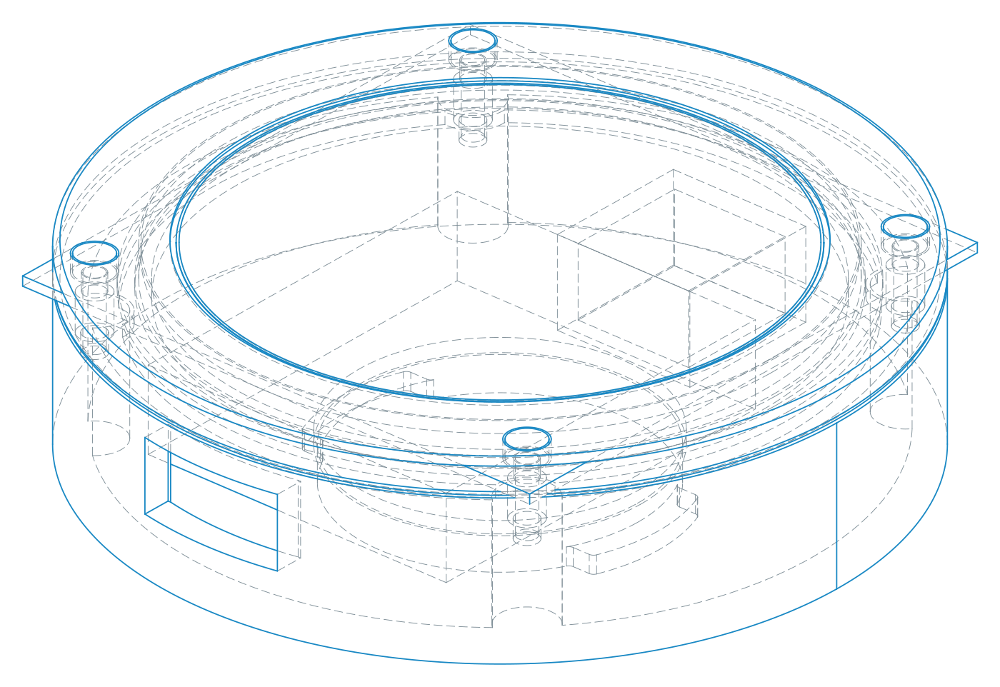

| 状态 | 已完成 / 待完成 |
| --- | --- |
| 已完成 | 共享 NavCore、RouteBundle、Web 圆屏、后端网关、V3 CAD/STEP/二维总装/佳明 A0 卡口，以及 R4 完整原理图、四层 PCB、BOM、CPL、审阅 Gerber/钻孔 |
| 已通过 | KiCad 10.0.6：ERC 0、全轨 DRC 0、未连接 0、一致性 0；BOM/CPL 93 个贴装引用完全对账；R4 包内 58 个文件哈希通过；V3 STEP 实体有效 |
| 待实物 | 高德真实 Key 长测、H0175Y003AMT003 V1 屏幕与 31P FFC 通断、GNSS 天线、罗盘校准、热点、佳明量规、温升、密封、振动 |
| 尚未完成 | 电源测试券、28 个采购/实物/RF 放行状态、正式生产签发、首批 PCBA、实体固件驱动和 EVT 外壳实测 |

> 立即下一步：到货后测量 H0175Y003AMT003 V1，用实物通断锁定 31P 模组接口、FFC 两端接触面和主板连接器的端到端引脚；同时继续关闭 USB-C、电源券、RF 和封装门槛。门槛关闭后再由 fab_release.py 生成正式投板包。

## 依据、引用与真实性边界

本方案将官方接口说明、开源逆向包络和本项目工程验证分开处理，不把任一项混写成量产认证。

### Garmin 官方

Quarter-turn Bike Mount，P/N 010-11430-00：确认 Edge 兼容体系。Garmin 安装说明确认对准卡榫与缺口、轻压并旋转锁止。

### 高德官方

路径规划 2.0 Web 服务确认驾车路线、途经点与策略能力；POI 搜索 Web 服务提供关键字、周边和 ID 查询。正式商业化仍需单独确认硬件终端、缓存和路况授权。

### 卡口尺寸来源

A0 的 Ø24.9 / Ø28.6 / 11 / 1.5 mm 来自开源 Garmin-style 四分之一转逆向模型，仅作为首轮样件包络。原装量规验配优先级高于开源模型。

- https://www.garmin.com/en-GB/p/65215/
- https://www8.garmin.com/manuals/webhelp/GUID-28E0106C-B05A-44E9-BF7C-9CB36A596B82/EN-US/GUID-60CB97C5-E3D6-4FF9-9147-9AAC1B773463.html
- https://github.com/chadkirby/quarter-turn-mount
- https://lbs.amap.com/api/webservice/guide/api/newroute
- https://lbs.amap.com/api/webservice/guide/api/search/

> NOT FOR FAB：H0175Y003AMT003 V1 供应商图纸已定义显示与盖板包络，但 31P 模组连接器 + FFC + 主板连接器的端到端引脚仍须通断签核；锁止槽、材料缩水、电池、天线、USB、密封和卡口也均需实物冻结。
